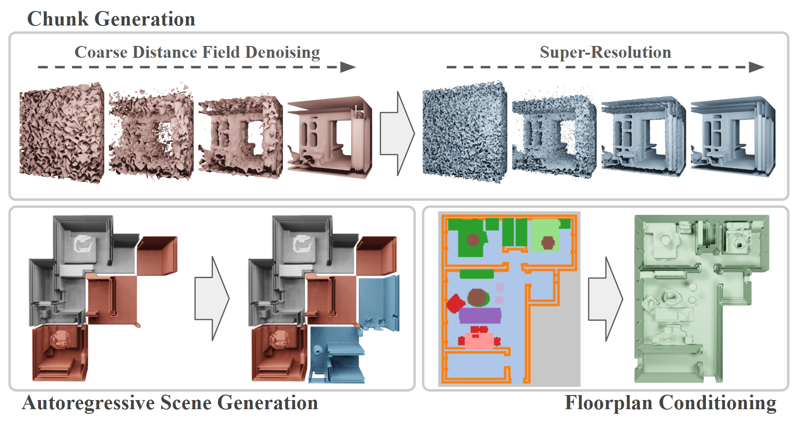
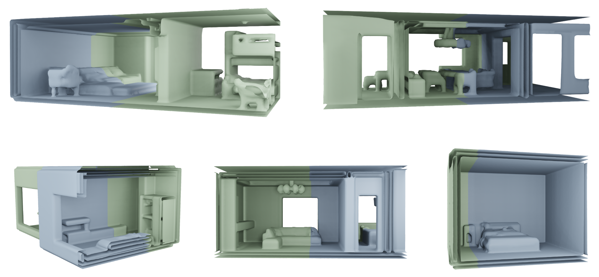
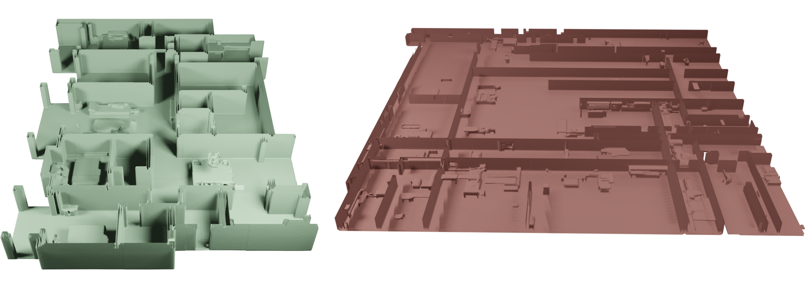

# Infinite Scene Generation Using Autoregressive Diffusion Models



## Information
We introduce InfiScene, a novel approach for generating unbounded large-scale 3D scenes using a new autoregressive diffusion model formulation. To this end, we tailor a diffusion model towards scene generation by successively synthesizing a dense distance field in a chunk-by-chunk fashion. This allows us to generate scenes of potentially arbitrary size, depending on the conditioning and the sampling of the trained model. Our approach relies on a diffusion-based 3D U-Net architecture, which operates on a coarse version of the scene. More specifically, we propose a diffusion-based super-resolution model to increase the resolution of the generated scene. To generate coherent scenes, the generation of each chunk is conditioned on its previously generated neighbours. The conditions are introduced at multiple scales within the U-Net to transfer both low-level features as well as higher-level ones. Our approach supports both high-quality scene generation in an unconditioned setting as well as a conditioned case based on floorplan inputs.

## Code

#### Installation
Please use the provided [environment](environment.yml) file to create a conda environment to run the scripts.

All scripts are assumed to be run from the root of the repository. The provided script parameters are minimal and additional information is kept brief, you can check out all of the possible paramers using the *--help* argument for each script.

#### Data Creation
The example data creation pipeline works for either version of the 3D-FRONT dataset. Due to issues with scaling and rotation matrices of furniture in v2, the initial version of the dataset might be preferred.

1. We first generate meshes from the provided scene JSONs:
```
python -m src.data_processing.voxelization.3d_front --dataset_path PATH_TO_DATASET
```

2. Afterwards we use an adapted version of the [SDFGen code by Batty](https://github.com/christopherbatty/SDFGen) to generate distance fields (DFs). The code was adjusted to use fixed voxel sizes instead of scene dimensions.

3. If required, semantic floorplans and semantic DF grids can be generated:
```
python -m src.data_processing.extend_df_semantics --json_path PATH_TO_DATASET --df_path PATH_TO_DF_DIR
```

4. If required, the height of scene can be extraced into a JSON file:
```
python -m src.data_processing.determine_scene_heights --dataset_path PATH_TO_DATASET
```

#### VAE Training
While seemingly not the best performing option, training a VAE for use in latent diffusion is supported:
```
python -m src.vae.train_latent --name EXP_NAME --data PATH_TO_DF_DIR
```
Use the CLI parameters of *--n_blocks* to specify the number of downsampling blocks, and *--latent_channels* to speficy the number of channels in the latent space.

#### Diffusion Training
For diffusion models we store the majority of relevant information in a corresponding JSON file. It needs to be specified for the initial training of the model and will be available in the models output directory from there on out. Please refer to the relevant [example](./model_configurations/model_coarse_base.json) if there are questions about the structure of the file.

```
python -m src.diffusion.train --name EXP_NAME --model_JSON PATH_TO_MODEL_JSON --train_data PATH_TO_TRAIN_DF_DIR --val_data PATH_TO_VAL_DF_DIR
```

The script supports and sometimes requires additional data (i.e. floorplans, boundaries, heights, semantics). Please ensure the model JSON and provided data match. Semantics are currently only used for loss weighting - if provided - and thus independent of the model JSON. The other types of data are used as additional conditions for the model.

If a VAE is used, it must be specified in the diffusion models JSON file as shown in [this example](model_configurations/legacy_vae_example.json).

In general, training a model generates output in two seperate directories. One contains the model, model JSON and training output; the other contains tensorboard logs. Subsequent training of the same models does not create new folders but instead adds an additional subrun folder to the existing directories.

#### Sampling
The main script used for sampling generates scenes in autoregressive chunk-by-chunk manner:
```
python -m src.sampling.scene_gen -n EXP_NAME --model_dir PATH_TO_COARSE_OUT_DIR --super_dir PATH_TO_SUPER_OUT_DIR 
```
- The *--floorplan* argument can be used for floorplan conditioned models. Boundary conditioning is currently not supported.
- The super-resolution model is not required, in which case a coarse scene is generated.
- The *--height_tech* parameter is used to specify the height of the scene in voxels. The number of voxels depends on the coarse model. If our data is used, scenes are either 51 or 71 voxels high, meaning this should be set to either 26 or 36.
- For descriptions on the individual sampling hyperparameters please refer to the [EDM paper](https://arxiv.org/abs/2206.00364).

#### Evaluation
Evaluation is assumed to be run on completely unconditioned models, i.e. their task is scene chunk generation similar to how shape generation models operate.

- Generate chunks from the unconditioned model, e.g.:
```
python -m src.sampling.generate_samples_two_step --model_json PATH_TO_MODEL_JSON --model_path PATH_TO_MODEL --super_scale_json PATH_TO_SUPER_JSON --super_scale_path PATH_TO_SUPER --out_PATH OUT_PATH 
```
Depending on the model the exact script to use may vary. Check out the *src/sampling* directory for the available options. The sampling hyperparameters are sometimes set as constants within the script, not using the CLI.
- Generate chunks from the ground truth:
```
python -m src.eval.generate_gt_df_folder --input_folder PATH_TO_DF_DIR --output_FOLDER OUT_PATH
```
- Compute the FID. First generate image directories:
```
python -m src.eval.eval_chunk_gen_images --df_folder PATH_TO_DF_DIR
```
Afterwards use an external FID repository (e.g. [pytorch-fid](https://github.com/mseitzer/pytorch-fid)) to calculate values.
- Compute other metrics. Check out the *src/eval* directory for implemented options.


## Examples



